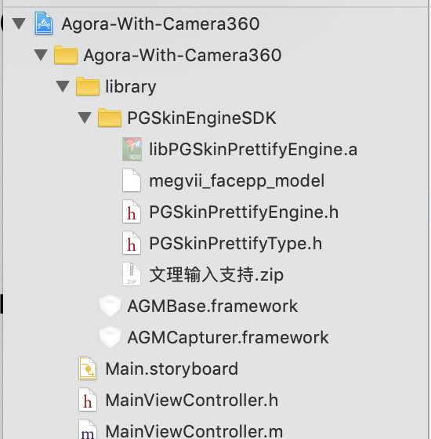

# Agora-With-Camera360 for Objective-C

*English | [中文](README.zh.md)*

## 一、下载 SDK
### 准备 Camera360 美颜 SDK

您需要联系 Camera360 美颜的工作人员为您定制 SDK 压缩包。 

## 二、集成 SDK
如下图所示，将下载好的 Camera360 SDK 和自采集 SDK，放到 Library 目录



在 Agora-With-Camera360-iOS 目录使用 cocoapods 命令安装 AgoraRtcKit SDK 和自采集 SDK

```
pod install
```
